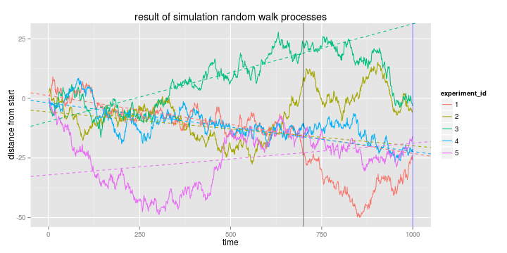

## Introduction

This study is implemented  as a Course Project of ["Development Data Product" course](https://www.coursera.org/course/devdataprod) taught by *Brian Caffo, PhD* at <http://coursera.org>    

It is an illustration of how we can blinded by optimizm appllying some regression models (that seems are good for past data)  to forecast time series from the future.

For example, after watching stock price time series, sometimes we can "feel" that discovered some "market laws"  and trends, but in fact it is very hard to forecast real-world time series data such as financial markets. 

I have decided to simulate some very simple stochastic process and I am going to show, that simple linear regression model does not work. As an others models it can explain past data very good, but it is illusion that it explain all time series.

--- .class #id 

## What is Gaussian Random Walk

A random walk is a formalization of a path that consists of a succession of random steps. Shortly, it can be implemented by the following formula:  **next position = prior position + some random step**.  A *Gaussion Random Walk* having a step size that varies according to a normal distribution is used.

 

--- .class #id 

## Illusion of trends

 

You can see, that  linear regression for the 3thd experiment (green)explains data from from 0 till 700 very good, but it fails to explain the "future" data after 700

--- .class #id 

## Demo Application

You can play with application, that simulates random walk procees, using the following link:  
https://goodok.shinyapps.io/random_walk_app  
(Please, don't use more than 8 hours, becouse it's restriction of the free hosting)

### Why simple regression models do not works?
In fact, time series are not a sets of Independent and Identically Distributed random variables values.

### Credits

This slides were produced under
R version 3.2.1 (2015-06-18)  
OS Version: Linux, 3.13.0-55-generic

